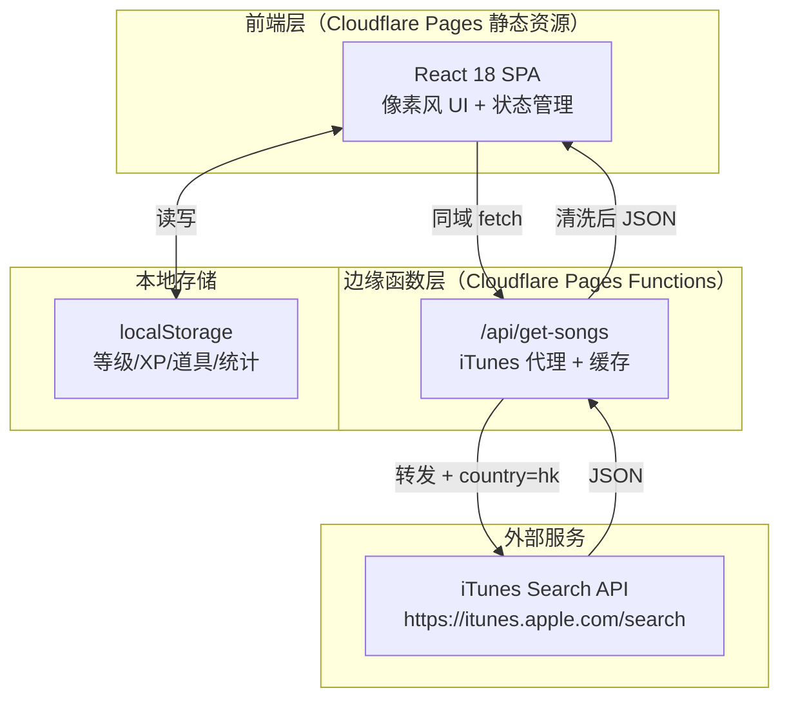

# 超级无敌估歌仔（Canto Party）技术架构文档

## 1. 架构设计



## 2. 技术说明
- **前端**：React 18 + TypeScript + Tailwind CSS 3 + Vite
- **初始化工具**：vite-init（react-ts 模板）
- **像素字体**：Press Start 2P（英文/数字）+ DotGothic16（繁体中文）通过 Google Fonts 引入
- **音频**：原生 HTML5 `<audio>` 元素直接播放 iTunes previewUrl（m4a）
- **后端**：Cloudflare Pages Functions（`functions/api/get-songs.ts`）零服务器成本
- **数据存储**：localStorage（无需数据库）
- **部署**：Cloudflare Pages（git push 自动部署）

## 3. 路由定义
| 路由 | 用途 |
|------|------|
| `/` | 首页（主菜单） |
| `/level` | 等级详情页 |
| `/game` | 答题核心页（单局 10 题） |
| `/round-result` | 本局成绩页 |
| `/settlement` | 最终结算页 |
| `/api/get-songs` | 后端代理接口（拉取 iTunes 歌曲） |

## 4. API 定义

### 4.1 后端代理接口 `/api/get-songs`

**请求**：
```typescript
interface GetSongsRequest {
  term: string;    // 搜索关键词（歌手名）
  limit?: number;  // 返回数量，默认 25，最大 50
}
```

**响应**：
```typescript
interface Song {
  trackId: number;
  trackName: string;       // 歌曲名（繁中）
  artistName: string;      // 歌手名（繁中）
  previewUrl: string;      // 30 秒 m4a 预览音频
  artworkUrl100: string;   // 专辑封面
  primaryGenreName: string;// 流派
}

interface GetSongsResponse {
  resultCount: number;
  songs: Song[];
}
```

**实现要点**：
- 转发到 `https://itunes.apple.com/search?media=music&country=hk&lang=zh_hk`
- 清洗：只保留有 `previewUrl`、`trackName`、`artistName` 的结果
- 响应头：`Access-Control-Allow-Origin: *`、`Cache-Control: public, max-age=3600`
- 内存缓存：同一 `term` 1 小时内不重复调用 iTunes（使用 `caches.default`）

### 4.2 前端备选方案：JSONP 直连
- 开发环境或 Functions 未就绪时使用
- 动态 `<script>` 标签请求 `https://itunes.apple.com/search?callback=cb&...`
- 错误处理能力弱，仅用于本地调试

## 5. 数据模型

### 5.1 localStorage 数据结构
```typescript
interface UserData {
  level: number;          // 当前等级，初始 1
  currentXP: number;      // 当前累计 XP，初始 0
  levelUpXP: number;      // 当前等级升级所需总 XP
  totalGames: number;     // 累计游戏局数
  totalCorrect: number;   // 累计答对题数
  items: {
    fiftyFifty: number;   // 50/50 道具，初始 3
    replay: number;       // 重播道具，初始 3
  };
}
```

### 5.2 题目数据结构
```typescript
interface Question {
  id: number;
  song: Song;             // 正确答案歌曲
  options: Song[];        // 4 个选项（含正确答案，已打乱）
  correctIndex: number;   // 正确答案在 options 中的索引
}

interface GameSession {
  questions: Question[];  // 10 道题
  currentIndex: number;   // 当前题号 0-9
  correctCount: number;   // 本局答对数
  usedFiftyFifty: boolean[];// 每题是否用过 50/50
  replayed: boolean[];    // 每题是否用过重播
  answers: (number | null)[];// 每题用户选择
}
```

## 6. 核心算法

### 6.1 题目生成
```typescript
// 1. 从预设歌手列表批量拉取歌曲池
const ARTISTS = ['鄭秀文', '陳奕迅', '張敬軒', 'Dear Jane', '容祖兒', '古巨基'];
// 2. 并发请求 /api/get-songs?term=歌手名&limit=25
// 3. 合并去重，过滤掉 previewUrl 为空的
// 4. 单题生成：随机抽 1 首作为正确答案，再抽 3 首不同歌曲作干扰
// 5. 4 选项打乱顺序，分配 A/B/C/D
// 6. 一次性生成 10 道不重复题目
```

### 6.2 等级 XP 计算
```typescript
// 1 级需 10 XP，每级递增：levelUpXP = 10 + (level - 1) * 5
function calcLevelUpXP(level: number): number {
  return 10 + (level - 1) * 5;
}
// 结算时：currentXP += 本局答对数；溢出则升级并累计
```

## 7. 性能优化
1. 首次加载预加载前 2-3 题音频（`new Audio(previewUrl).preload='auto'`）
2. 歌曲池 localStorage 缓存 24 小时（key: `songPool_v1`，存时间戳）
3. 音频切换无缝衔接：缓存下一题 audio 实例
4. Pages Functions 使用 `caches.default` 缓存 iTunes 响应 1 小时

## 8. 项目结构
```
/
├── functions/
│   └── api/
│       └── get-songs.ts      # Cloudflare Pages Functions 代理
├── src/
│   ├── components/           # 复用组件（PixelButton, ProgressBar, Badge）
│   ├── pages/                # 5 个页面组件
│   │   ├── Home.tsx
│   │   ├── LevelDetail.tsx
│   │   ├── Game.tsx
│   │   ├── RoundResult.tsx
│   │   └── Settlement.tsx
│   ├── hooks/                # 自定义 hooks（useUserData, useGameSession, useSongPool）
│   ├── lib/                  # 工具函数（storage, itunes, audio）
│   ├── data/                 # 歌手列表等常量
│   ├── types/                # TypeScript 类型定义
│   ├── App.tsx               # 路由 + 全局状态
│   ├── main.tsx
│   └── index.css             # Tailwind + 像素风全局样式
├── index.html
├── package.json
├── tailwind.config.js
├── tsconfig.json
└── vite.config.ts
```
